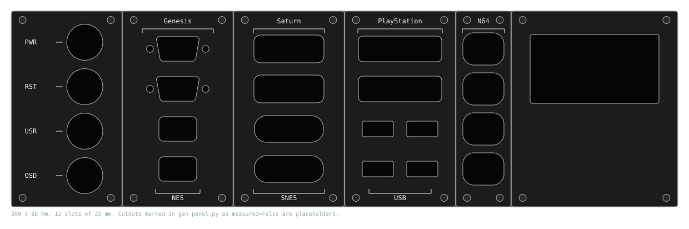

# hw/panel — the modular controller front panel

Status, 2026-09-21: **generated boards, nothing ordered, no connector measured.**
The design study behind this is `docs/controller-front-panel.md`; the port
survey with the depth check is `docs/port-atlas.html`; this directory is where
they become files.

Everything here is produced by one script. Do not edit a `.kicad_pcb` by hand;
edit the tables in `gen_panel.py` and rerun it:

```
python3 hw/panel/gen_panel.py
```

| File | What | Fab as |
|---|---|---|
| `frame.kicad_pcb` | the front rails as one sheet, 300 × 88 mm, 12 slots; strip opening behind the module slots, button holes, M3 pattern at every slot edge | FR4 1.6 mm, any colour |
| `seg_buttons.kicad_pcb` | 2 slots: four 16 mm illuminated buttons with labels | aluminium-core PCB, black mask, white silk |
| `seg_genesis_nes.kicad_pcb` | 2 slots: two DE-9 over two NES | same |
| `seg_saturn_snes.kicad_pcb` | 2 slots: two Saturn over two SNES | same |
| `seg_psx_usb.kicad_pcb` | 2 slots: two PlayStation over four USB-A | same |
| `seg_n64x4.kicad_pcb` | 1 slot: four N64 stacked | same |
| `seg_snac4.kicad_pcb` | 1 slot: four USB3-A sockets wired as MiSTer user ports (§ 3.4) | same |
| `seg_display.kicad_pcb` | 3 slots: window for a 2.42" 128 × 64 OLED | same |
| `seg_blank1`, `seg_blank2` | blanks | same |
| `card_template.kicad_pcb` | outline, standoff holes, row marks and ribbon header for a cassette card | start of every module |
| `backplane/` | the rear board's own project: `backplane.kicad_sch` from `gen_backplane_sch.py` (two RP2350B, two FE1.1s hubs, ten ports with DIP identity, pass-through), `backplane.kicad_pcb` from `gen_panel.py` (outline, rails, connectors on the grid). Circuit described in `BACKPLANE.md` | FR4, 4-layer once routed |
| `preview.svg` | the example assembly, drawn from the same numbers | — |
| `panel.kicad_pro` | the KiCad project; open any board from it | — |



## 1. The scheme: a card cage

Each panel section is a **cassette**: a visible segment, the rails it screws
through, four M3 standoffs, and a card parallel to the plate carrying the
sockets and a ribbon header. The cassette is one rigid unit that plugs into a
**backplane** 80 mm behind the plate. The backplane is where the intelligence
is. A cassette is dumb: sockets and level shifters, nothing else, which is
exactly what a MiSTer SNAC adapter is.

Side view, one slot:

```
  front                                                                 rear
  ──┬───┬──────────────────────────────────────────────────────────────────
    │seg│rail          ═══ M3 standoff, length = deepest socket ═══ ║ card
    │   │                                                           ║
  plug ▶▶▶▶▶▶ straight socket, pins through the card ▶▶▶▶▶▶▶▶▶▶▶▶▶▶▶▶▶╣ row 1
    │   │                                                           ║
  plug ▶▶▶▶▶▶ right-angle socket on a shelf ══════════════════════════╣ row 3
    │   │                                                           ║  ┌─ 2x5 ribbon ─┐
    │   │                                                           ║ ─┘              └─▶ [2x5]  backplane
    │   │        ═══ standoff ═══                                   ║                     [USB3-A]  RP2350B, hub
  ──┴───┴───────────────────────────────────────────────────────────╨──────────────────── rear rails
    |◀────────────────────────── 80 mm ───────────────────────────────────────────▶|
```

| Part | Role | Changes when… |
|---|---|---|
| **Segment** (visible plate, `seg_*`) | the face: cutouts for one module's plugs, its labels | a socket is measured, a family is added |
| **Rails** (`frame` as one sheet, or bars in the tray) | the M3 pattern every cassette screws through, front and rear | the panel width changes |
| **Card** | PCB parallel to the plate, as wide as its segment, full height: sockets on the front face, shifters on the back, a 2×5 box header for the ribbon | never for other modules' sake |
| **Shelf** | small horizontal sub-board joined to the card at 90°, for sockets that only exist right-angle | per module |
| **Standoffs** | four M3 female-female per cassette, length = that card's deepest socket | per module |
| **Backplane** | vertical board on the rear rails: one SNAC port per slot as USB3-A socket and 2×5 header in parallel, two RP2350B that speak the console protocols, two USB hubs, 5 V in, host USB out, the button and display harness | never for a family's sake |
| **Tray** | 3D-printed or bent sheet: front rails, rear rails, 80 mm apart | the panel width or depth changes |

**One screw does everything.** At each of a cassette's four corners an M3
screw passes through the segment and the rail into the front of a standoff;
a second screw from behind passes through the card into the standoff's rear.
The rail is clamped in the sandwich, so the frame sheet is never load-bearing
on its own, and the tray's rails can replace it outright.

**Sockets come in whichever mounting style their console used, and the card
takes both.** Straight-mount sockets (a vertical DE-9, the NES and SNES port
sockets, which sat on vertical boards behind the console's face) solder
straight through the card. Right-angle sockets (N64, PlayStation and Genesis
sat on their mainboards' front edges) sit on a shelf: a strip of PCB at the
row's height, joined to the card's front face with a row of pins or
castellations, its sockets facing forward. The standoff length puts every
socket face at the back of the rail; a card with two socket depths puts the
shallower one on a riser.

**Sockets sit behind the plate, not in it.** The cutout passes the *plug*; the
socket body is wider than the cutout and bears on the back of the rail during
unplugging, which is how consoles do it. Plug insertion pushes on the card,
which the standoffs carry. The DE-9 also has jack posts through both plates,
so the Genesis cassette is the stiffest and the one to build first.

**A bought SNAC adapter is a cassette too.** A blank segment with a hole for
its socket, the adapter fixed behind it, its pigtail into the backplane's
USB3-A socket. That is the sourcing escape hatch: a console the panel has no
module for is covered by parts other people already make.

## 2. The grid

| | mm | Why |
|---|---:|---|
| Slot pitch | 25 | a NES or N64 socket beside a card fits one slot; DE-9, SNES, Saturn, PlayStation, Dreamcast take two |
| Panel height | 88 | four socket rows plus rails; 2U is 88.9 |
| Rails | 8 top, 8 bottom | M3 button heads at y = 4 and 84 |
| Screws | M3, Ø3.2 clearance | 5 mm inside each segment edge, top and bottom: four per cassette, on the pattern 25k+5 and 25k+20 |
| Segment gap | 0.3 total | segments tile at exactly 25 mm per slot |
| Rows | y = 17, 35, 53, 71 | 18 mm pitch; the tallest plug (N64, ~15 mm) leaves 3 mm |
| Frame opening | x 50…295, y 8…80 | everything behind the module slots is open; a 5 mm stile remains at the right |
| Card | 86 tall, segment width less 1 mm each side | holes on the segment's screw pattern |
| **Depth, plate to backplane** | **80** | deepest socket ~25, card and parts 8, ribbon header and plug 12, ribbon bend 15, plate 3.2: 63 used, 17 spare (`docs/port-atlas.html`) |
| Standoff length | per module, 13 to 25 | = deepest socket on the card |

## 3. The port

### 3.1 Ribbon, 2×5 at 2.54 mm

Every backplane port is a 2×5 shrouded box header and a USB3-A socket wired
in parallel. Our cassettes use the header and a short IDC ribbon; bought SNAC
dongles use the socket.

```
   1  +5V       2  GND
   3  IO1       4  IO2
   5  IO3       6  IO4
   7  IO5       8  IO6
   9  IO7      10  GND
```

| Group | Spec |
|---|---|
| +5V | 500 mA polyfuse per port on the backplane |
| IO1…IO7 | 3.3 V, **open-drain both ways, 10 kΩ pull-up to 3.3 V on the backplane**. This is exactly how the MiSTer FPGA drives its user port (`sys_top.v`: each `USER_IO` pin drives 0 or high-Z, verified this session), so a port behaves like one MiSTer user port |

There is no 3.3 V supply on the port and no sense pin: a cassette that needs
3.3 V (PlayStation, N64, GameCube) makes it with an LDO, as SNAC adapters do,
and the backplane learns what is on each port from a 4-position DIP switch
beside the port, whose codes are in `BACKPLANE.md` § 3.

### 3.2 SNAC channel order

IO1…IO7 follow blue212's SNAC, so a cassette's wiring is the same as the
corresponding SNAC console adapter's, and the backplane's USB3-A sockets are
pin-compatible with the MiSTer user port. From the SNAC Eagle schematic
(`SNAC 7ch USB3-5v.sch`, read this session; channel n is its `LVn`/`HVn` net):

| Port pin | Channel | USB3-A receptacle pin (name) |
|---|---|---|
| IO1 | 1 | 8 (StdA_SSTX−) |
| IO2 | 2 | 2 (D−) |
| IO3 | 3 | 7 (GND_DRAIN) |
| IO4 | 4 | 3 (D+) |
| IO5 | 5 | 6 (StdA_SSRX+) |
| IO6 | 6 | 5 (StdA_SSRX−) |
| IO7 | 7 | 9 (StdA_SSTX+); jumpered on the SNAC, the "io6 for SEGA" line in its README |
| +5V | — | 1 (VBUS) |
| GND | — | 4 (GND) |

The USB3-A pin numbers are the connector standard's, from memory; check them
against any USB 3.0 receptacle drawing before the backplane is routed.
**Which `USER_IO[n]` bit each channel is on the MiSTer I/O board is not
verified** — the I/O board release archive holds Gerbers only. It matters for
one thing: the optional pass-through port (§ 3.5). Measure it once on an I/O
board with a meter and record it here.

### 3.3 What the backplane does with a port

An RP2350B per five ports polls the native protocol over the ribbon and
presents each pad as a USB HID gamepad through the hub; the DIP code picks
the protocol (`BACKPLANE.md`). This is the original
single-board electronics of the design study moved to a vertical board; the
protocols, level and timing arguments there stand. Ten centimetres of ribbon
at 3.3 V open-drain is the same signalling the MiSTer user port already runs
over 30 cm USB3 extensions.

Ports that are not consoles do not use SNAC lines: a front USB section wires
its USB-A sockets to one of the backplane's four 1×4 hub headers; a keyboard,
analogue-stick or DA-15 section carries its own MCU and uses a hub header too.

### 3.4 The SNAC segment

`seg_snac4` is four USB3-A sockets on the front, each wired 1:1 through a
ribbon to one backplane port. It puts MiSTer user ports on the face of the
box, for adapters that live outside it.

### 3.5 Pass-through to a real MiSTer

One backplane port can be routed by a jumper to an external USB3-A socket on
the rear instead of to its RP2040. Plug that into the MiSTer's own user port
and the cassette on it is driven by the FPGA at zero latency, exactly as a
SNAC adapter would be, while every other cassette goes through USB. This is
the one place the `USER_IO` bit order matters.

## 4. What is placeholder

Every cutout except the 16 mm button hole is marked `measured=False` in
`gen_panel.py`, and each generated segment says so on its `Cmts.User` layer.
The numbers are plausible enough to check the layout and to print 1:1 on
paper; they are not good enough to order aluminium.

The gate, unchanged from the study: buy two of every socket from two sellers,
measure pin pitch, body, face-to-pin depth and the plug profile, replace the
table entries, rerun, print 1:1, push the real plugs through the paper.
`SOURCING.md`, when it lands, says where to buy them.

The DE-9 is the one cutout with a standard behind it (D-sub size E: 19.3 wide,
11.0 high, 10° sides, jack-screw holes 24.99 apart, from memory); confirm it
against the datasheet of the part actually ordered.

The backplane's USB3-A footprints are placeholders with the right pin count
and a body of about the right size. Replace them with the vendor footprint
before routing; only the positions are meant to survive.

## 5. Ordering notes

- Segments: JLCPCB "aluminium PCB", 1.6 mm, black solder mask, white silk,
  single layer, no copper needed. Internal cutouts on `Edge.Cuts` are routed;
  keep inside corners ≥ 0.5 mm radius (all are).
- Frame: FR4 1.6 mm, any colour, no copper. At 300 × 88 it is the largest
  board; if the fab's cheap tier caps at 100 mm, split it at slot 6 with a
  lap joint — the tray rails carry it anyway.
- Backplane: 300 × 88, 4-layer once routed: a ground plane under ten ESD entry
  points and the hub's high-speed upstream pair is worth the price.
- Cards: ordinary 2-layer FR4.
- Screws: M3 × 8 button head, black oxide, front; M3 × 6 rear; M3
  female-female standoffs in 13, 17, 20, 22 and 25 mm to match the sockets.
- Ribbons: 10-way IDC, 100 to 150 mm, both ends female 2×5.

## 6. Next

1. **Genesis cassette first**: the DE-9 is a catalogue part with a datasheet
   and STEP model, so the whole mechanical chain (segment, rails, standoffs,
   card, ribbon, backplane port) can be proven without waiting on a single
   AliExpress socket.
2. Backplane: ERC and footprint assignment in KiCad on the generated
   schematic, complete the hub chips from the FE1.1s reference design, then
   route (`BACKPLANE.md` § 6).
3. Then the measured sockets, one cassette per family, in whatever order they
   arrive; a bought SNAC adapter behind a blank fills any gap meanwhile.
